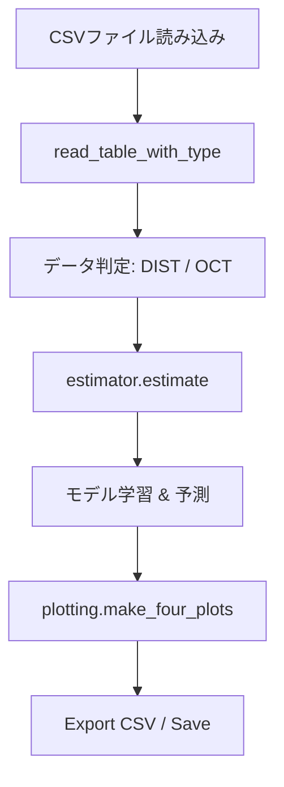
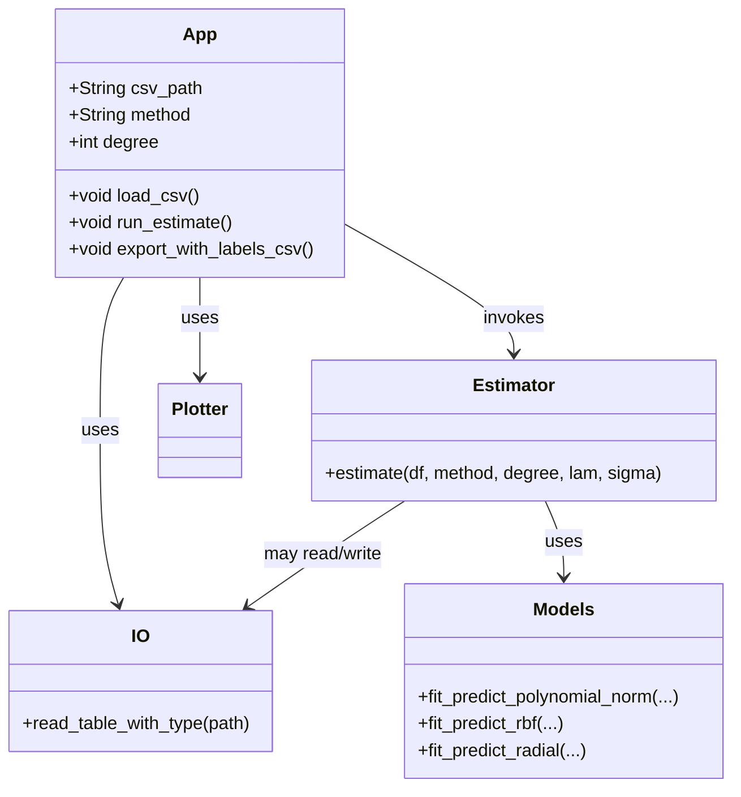

# MatEst システム構成ドキュメント

このドキュメントは本ソフトウェア（MatEst / F-theta Estimator）の構成をまとめたものです。

## 1. 概要
MatEst は、理想座標（Ideal）と実測座標（Real）の対応から歪補正マップを生成するツールです。GUI から操作し、CSV の読み込み → 推定 → プロット → エクスポートを行います。

## 2. システム構成
- ユーザーインターフェース: `matest.gui.App`（Tkinter + ttk）
- 入出力: `matest.io.read_table_with_type`（CSV 読込、DIST/OCT 判定）
- 計算エンジン: `matest.estimator`（推定フローの序列化）
  - 数値モデル: `matest.models`（多項式、RBF、Radial など）
  - AxisRadial 固有: `matest.axisradial`（軸別スケーリングの学習/予測）
  - アフィン/回転抽出: `matest.affine`（最小二乗アフィン適合、回転抽出）
- プロット: `matest.plotting`（4 枚のサブプロット作成）
- 起動スクリプト: `run_ftheta_gui.py`
- データフォルダ: `data/`（CSV 保存・サンプルデータ）


## 3. コンテキスト図
以下はシステムの高レベルな関係図です（Mermaid）:

```mermaid
graph LR
  User[ユーザー]
  GUI[MatEst GUI<br/>(matest.gui.App)]
  IO[CSV IO<br/>(matest.io)]
  Est[Estimator<br/>(matest.estimator)]
  Models[数値モデル<br/>(matest.models, axisradial, affine)]
  Plot[Plotter<br/>(matest.plotting)]
  FS[Filesystem<br/>(data/, docs/)]

  User --> GUI
  GUI --> IO
  GUI --> Est
  GUI --> Plot
  IO --> FS
  Est --> Models
  Est --> IO
  Est --> Plot
  Plot --> FS
```

## 4. データフロー図
CSV を読み込んで補正マップを出力する基本的な流れを示します。



## 5. クラス図（概念）
本プロジェクトは関数モジュール中心ですが、GUI 部分は `App` クラスを持ちます。主要要素を概念的に示します。



## 6. 運用メモ
- ウィンドウは固定サイズ（1584x1024 相当の設定）で起動します。
- 依存: `pandas`, `numpy`, `matplotlib`。
- ドキュメントや設計図は `docs/` に保存済み。

---

作成者: 自動生成ドキュメント
日付: 2026-05-05
