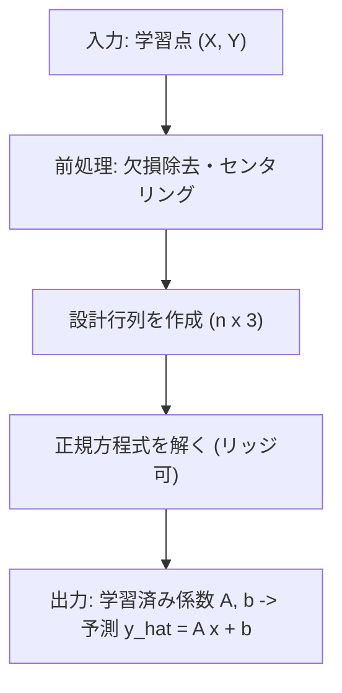
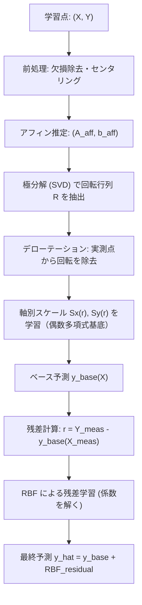
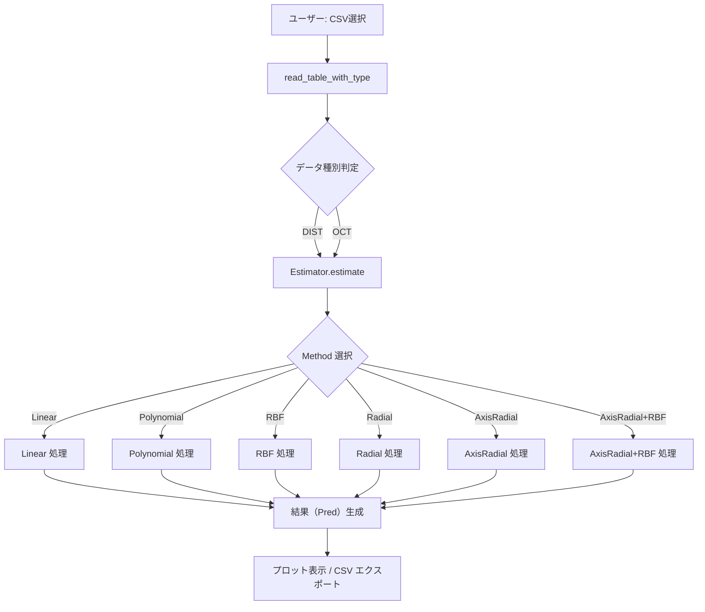
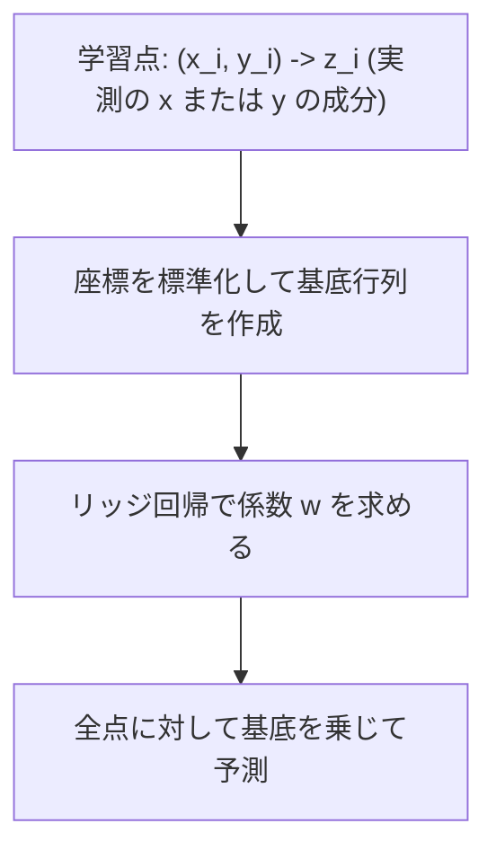
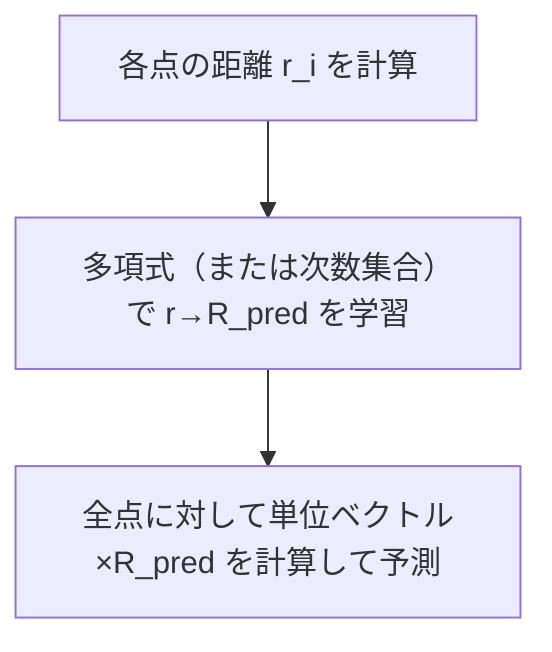
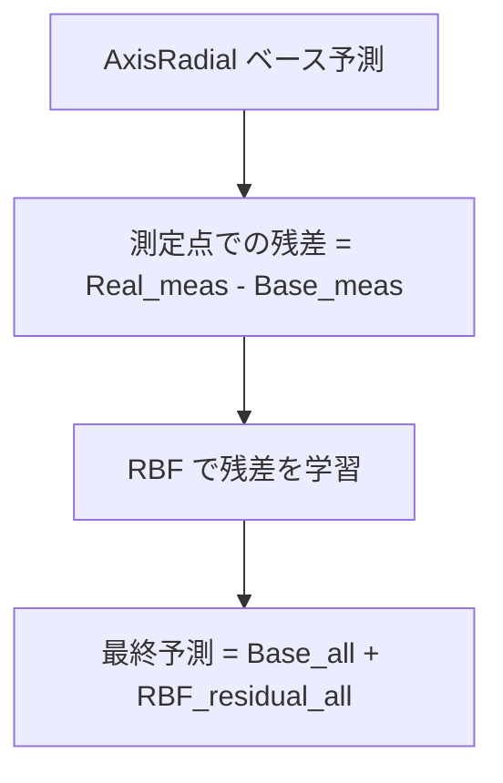

# MatEst ユーザーマニュアル — Linear と AxisRadial+RBF に特化した数学資料

この文書は MatEst で実際に使用している 2 つの主要手法、`Linear`（アフィン）と `AxisRadial+RBF`（ハイブリッド）に絞って、
フローチャート、完全な式変形、実装に必要な数値上の注意点までを順序立てて示します。実務者が実装・検証できるレベルの数式を含みます。

目次
- 用語と記法
- データ表現と前処理
- Linear（アフィン）: モデル、導出、実装要点
- AxisRadial+RBF: 手順、導出、結合法
- 数値安定化、正規化、パラメータ選定
- 実装疑似コードと例

---

## 用語と記法
- 点集合: 理想座標を $\{\mathbf{x}_i\}_{i=1}^n$, 実測座標を $\{\mathbf{y}_i\}_{i=1}^n$ とする。各点は列ベクトル $\mathbf{x}_i=[x_i, y_i]^T$, $\mathbf{y}_i=[x'_i, y'_i]^T$。
- 行列: $X\in\mathbb{R}^{n\times2}$ は各行が $\mathbf{x}_i^T$、$Y\in\mathbb{R}^{n\times2}$ は各行が $\mathbf{y}_i^T$。
- 拡張行列: $\widetilde{X}=[X,\;\mathbf{1}]\in\mathbb{R}^{n\times3}$（最後の列は全1）。

---

## データ表現と前処理
1. 欠損値の除外: 実測が NaN の行は学習用から省く（ただし予測する点は別）。
2. センタリング: 各座標列の平均を引いてから学習する。実装では後でバイアスを復元するために平均を保存する。
   - $\bar{\mathbf{x}}=\frac{1}{n}\sum_i\mathbf{x}_i,\; \bar{\mathbf{y}}=\frac{1}{n}\sum_i\mathbf{y}_i$。
   - 中心化されたデータ $X_c = X - \mathbf{1}\bar{\mathbf{x}}^T,\; Y_c = Y - \mathbf{1}\bar{\mathbf{y}}^T$。
3. スケーリング（任意）: 座標の長さや画像最大長で割って数値スケールを整えると条件数が改善される。

---

## Linear（アフィン）: モデル、導出、実装要点

目的: アフィン写像 $(A,b)$ を求め、$\mathbf{y}\approx A\mathbf{x}+\mathbf{b}$ を満たすようにする。

ステップ 1 — モデルと行列表現
$$\mathbf{y}_i = A\mathbf{x}_i + \mathbf{b} + \varepsilon_i$$
行列形式で: $Y = X A^T + \mathbf{1}\mathbf{b}^T + E$（各行が点）。

ステップ 2 — 拡張設計行列
拡張して $\widetilde{X}=[X,\;\mathbf{1}]\in\mathbb{R}^{n\times3}$, 係数行列を $\Theta = [A^T;\;\mathbf{b}^T]\in\mathbb{R}^{3\times2}$ と表す。
目的関数（リッジ正則化を含む）:
$$J(\Theta)=\|\widetilde{X}\Theta - Y\|_F^2 + \lambda\|L\Theta\|_F^2.$$ 
ここで $L$ は正則化マスク（例えば上2行に重み、バイアス行は0にするなど）。

ステップ 3 — 正規方程式（閉形式解）
$$\Theta^* = (\widetilde{X}^T\widetilde{X} + \lambda L^T L)^{-1}\widetilde{X}^T Y.$$ 

ステップ 4 — 実装上の注意
- 中心化された $X_c,Y_c$ を用いるとバイアス項は簡単に求まる。具体的にはまず $A$ を学習し、$\mathbf{b}=\bar{\mathbf{y}} - A\bar{\mathbf{x}}$ を使って復元する方法が安定。
- 逆行列を直接計算するより SVD（または np.linalg.lstsq）を用いることを推奨。条件数が高ければ Tikhonov 正則化（上の $\lambda$）を増やす。

簡易フローチャート:


計算量: 主に $\widetilde{X}^T\widetilde{X}$ の計算 $O(n)$ と 3x3 逆行列の計算（定数）。実稼働では非常に速い。

---

## AxisRadial+RBF（順序立てた導出と結合）

このハイブリッドは 3 項目に分かれる:
- (A) ベースモデル: AxisRadial（アフィン→回転除去→軸別放射スケール）
- (B) 残差計算: ベースモデルと実測の差
- (C) 局所補正: 残差に対して RBF を学習して最終予測に加える

全体フローチャート:


詳細手順と式変形:

(A) アフィン推定（同上）: $A_{aff},\;\mathbf{b}_{aff}$ を Linear 手順で得る。

(B) 極分解で回転抽出:
1. SVD を使い $A_{aff} = U\Sigma V^T$ を計算。
2. 直交行列 $R = U V^T$ を回転成分として取る（反射を排除するために必要なら det 調整）。

数学的裏付け: 任意の正則行列は Polar decomposition $A_{aff}=R S$（$R$ は直交、$S$ は対称正定値）を持ち、SVD を用いることで効率的に $R$ が得られる。

(C) Derotate（回転を除去）:
$$\widetilde{Y} = R^T( Y - \mathbf{1}\mathbf{b}_{aff}^T ).$$
対応する Ideal はセンタリング済みの $X_c$ を使用。

(D) 軸別スケール学習:
モデル: 各点の半径 $r_i=\|\mathbf{x}_i\|$ を計算し、偶数次数基底 $\phi_k(r)=r^{2k}$ を用いて
$$S_x(r)=\sum_{k=0}^p a_k \phi_k(r),\qquad S_y(r)=\sum_{k=0}^p b_k \phi_k(r).$$
式変形: 予測モデル（derot 空間）について
$$\widetilde{y}_{i,x} \approx S_x(r_i) x_i,\qquad \widetilde{y}_{i,y} \approx S_y(r_i) y_i.$$ 
これを行列式で書くと、例えば X 軸成分用に設計行列 $\Phi\in\mathbb{R}^{n\times(p+1)}$ を作り:
$$\Phi_{i,k} = \phi_k(r_i) x_i,$$
ターゲット $z_x=[\widetilde{y}_{i,x}]_{i=1}^n$ に対しリッジで
$$a^* = (\Phi^T\Phi + \lambda I)^{-1}\Phi^T z_x.$$ 
同様に Y 軸成分を解く。

数値注意: $r$ は画像対角長などで正規化する。$\Phi$ の列はスケール差が大きくなるため列標準化をする。

(E) ベース予測の復元:
任意の点 $\mathbf{x}$ に対して
$$\mathbf{y}^{(base)}(\mathbf{x}) = R\begin{bmatrix}S_x(\|\mathbf{x}\|) x \\ S_y(\|\mathbf{x}\|) y\end{bmatrix} + \mathbf{b}_{aff}.$$ 

(F) 残差学習（RBF）:
1. 学習点で残差を取る: $\mathbf{r}_i = \mathbf{y}_i - \mathbf{y}^{(base)}(\mathbf{x}_i)$（各成分別に扱う）。
2. カーネル $k(\mathbf{x},\mathbf{x}')=\exp(-\|\mathbf{x}-\mathbf{x}'\|^2/(2\sigma^2))$ としてカーネル行列 $K$ を作る。
3. 係数は
$$\alpha = (K + \lambda I)^{-1} r$$
予測残差:
$$\Delta(\mathbf{x}) = k(\mathbf{x}, X)\alpha.$$ 

結合:
最終予測は
$$\hat{\mathbf{y}}(\mathbf{x}) = \mathbf{y}^{(base)}(\mathbf{x}) + \Delta(\mathbf{x}).$$

実装上の効率化:
- 残差の RBF 学習は学習点数が多いと高コストなので、Nyström 法、近傍限定カーネル、またはランダム Fourier 特徴量で近似する手法を検討する。
- AxisRadial のスケール学習は $p$（次数）を小さくして過学習を防ぐ。

---

## 数値安定化・正規化・パラメータ指針
- センタリングはほぼ常に行う。学習後にバイアスを復元する。
- 設計行列の列はゼロ平均・単位分散にすると数値が安定する。
- 正則化 $\lambda$ は通常 $10^{-6}\sim10^{-2}$ の範囲で探索。
- RBF の $\sigma$ は学習点間距離の中央値を基準に $[0.5,2.0]$ 倍で探索。
- SVD を用いた擬似逆は条件数が高い場合の救済策。

---

## 実装疑似コード（Python 風）
```python
# 前処理
Xc, Yc, x_mean, y_mean = center(X, Y)

# 1) Affine fit
Theta = ridge_solve(concat(Xc, ones), Yc, lambda_aff)
A_aff = Theta[:2,:].T; b_aff = recover_bias(Theta, x_mean, y_mean)

# 2) Polar decomposition
U,S,Vt = svd(A_aff)
R = U @ Vt

# 3) Derotate
Ytil = (Y - b_aff) @ R.T

# 4) Axis scaling fit
Phi_x = build_phi(r, x_coords, degree)
ax = ridge_solve(Phi_x, Ytil[:,0], lambda_ax)
Phi_y = build_phi(r, y_coords, degree)
ay = ridge_solve(Phi_y, Ytil[:,1], lambda_ay)

# 5) Base prediction function
def y_base(x):
    r = norm(x)
    sx = phi(r) @ ax
    sy = phi(r) @ ay
    y_derot = [sx * x[0], sy * x[1]]
    return (R @ y_derot) + b_aff

# 6) Residuals and RBF
r = Y_meas - y_base(X_meas)
K = kernel_matrix(X_meas, X_meas, sigma)
alpha = solve(K + lambda_rbf * I, r)
def rbf_residual(x):
    return kernel_vector(x, X_meas) @ alpha

# 7) Final prediction
def predict(x):
    return y_base(x) + rbf_residual(x)
```

---

ドキュメント更新日: 2026-05-05

---

## 用語と記法
- 点集合: 理想座標を $\{\mathbf{x}_i\}_{i=1}^n$, 実測座標を $\{\mathbf{y}_i\}_{i=1}^n$ とする。各点は $\mathbf{x}_i = [x_i, y_i]^T,\; \mathbf{y}_i = [x'_i, y'_i]^T$。
- 行列・ベクトル: 太字で表す。$X$ は行を点、列を特徴とする設計行列を意味することがある。
- ノルム: $\|\cdot\|$ は Euclid ノルム。\

## 入力データ形式（公式）
MatEst は内部で全て以下の統一表現に変換して扱う。
$$\text{Ideal}_i = (x_i, y_i),\qquad \text{Real}_i = (x'_i, y'_i).$$
OCT 形式は与えられた測定位置 $m_i$ と補正量 $c_i$ から $\mathbf{y}_i = \mathbf{m}_i + \mathbf{c}_i$ を作成します。

---

## 1. Linear（アフィン） — 導出と安定化

目的: アフィン変換 $(A,b)$ を求め、理想点 $\mathbf{x}_i$ を線形写像で実測に近づける。

モデル:
$$\mathbf{y}_i \approx A\mathbf{x}_i + \mathbf{b},\quad A\in\mathbb{R}^{2\times2},\; \mathbf{b}\in\mathbb{R}^2.$$ 

最小二乗問題（全点を一括）:
令 $Y= [\mathbf{y}_1,\dots,\mathbf{y}_n]^T\in\mathbb{R}^{n\times2}$, $X=[\mathbf{x}_1,\dots,\mathbf{x}_n]^T\in\mathbb{R}^{n\times2}$。
拡張行列 $\widetilde{X} = [X,\;\mathbf{1}]$ を作り、未知量 $\Theta = [A^T,\;\mathbf{b}]^T\in\mathbb{R}^{3\times2}$ と表せる。
最小化問題:
$$\min_{\Theta}\;\|\widetilde{X}\Theta - Y\|_F^2,$$
ここで $\|\cdot\|_F$ は Frobenius ノルム。

正則化（リッジ）を入れる場合:
$$\min_{\Theta}\;\|\widetilde{X}\Theta - Y\|_F^2 + \lambda\|\Theta_{[:2,:]}\|_F^2,$$
（注: バイアス項 $\mathbf{b}$ に正則化をかけない選択も可能）

解（正規方程式）:
$$\Theta^* = (\widetilde{X}^T\widetilde{X} + \lambda\widetilde{R})^{-1}\widetilde{X}^T Y,$$
ここで $\widetilde{R}$ は $3\times3$ の正則化行列（最後の行列要素が0ならバイアスは正則化されない）。

数値安定化の実践:
- $\widetilde{X}^T\widetilde{X}$ の条件数が高い場合は SVD を用いた擬似逆行列を推奨。
- 入力座標の平均を引き（センタリング）、スケール（標準偏差）で割ることで条件数が改善される。

計算量: 枚数 $n$ に対して $O(n)$ のコストで $\widetilde{X}^T\widetilde{X}$ を作成し、$3\times3$ の逆行列を解くため定数時間。

---

## 2. Polynomial（2次元多項式回帰）

目的: 基底関数 $\phi_j(\mathbf{x})$ を用いて、実測成分 $z_i$（各座標成分）を回帰する。ここでは独立に $x'$ と $y'$ を推定する。

基底と設計行列:
次数 $d$ を与えると、すべての組 $(i,j)$ で $i+j\le d$ の単項式 $x^i y^j$ を基底とする。基底数を $p$ とすると、設計行列 $\Phi\in\mathbb{R}^{n\times p}$ を定義:
$$\Phi_{k,j} = \phi_j(\mathbf{x}_k).$$

リッジ回帰:
$$\min_{w}\;\|\Phi w - z\|_2^2 + \lambda\|w\|_2^2$$
解は正規方程式で得られる:
$$w^* = (\Phi^T\Phi + \lambda I_p)^{-1}\Phi^T z.$$ 

数値上の留意点:
- $\Phi$ の列は高次になるほどスケールが大きくなるため、各列を標準化（ゼロ平均・単位分散）すること。
- 基底選択: 全単項式を使うと $p=O(d^2)$ で増えるため、高次は注意。

計算量: $O(np^2 + p^3)$（直接法）。大きな $p$ は計算負荷とメモリを増大させる。

---

## 3. RBF（Radial Basis Function）

モデル（ガウスRBF）:
設計点 $\{\mathbf{c}_j\}_{j=1}^m$（通常は学習点自体を用いる $m=n$）に対し、
$$k(\mathbf{x},\mathbf{c}_j) = \exp\left(-\frac{\|\mathbf{x}-\mathbf{c}_j\|^2}{2\sigma^2}\right).$$

学習（カーネルリッジ）:
測定残差ベクトルを $z\in\mathbb{R}^n$ とするとカーネル行列 $K\in\mathbb{R}^{n\times n}$ を定義:
$$K_{ij} = k(\mathbf{x}_i,\mathbf{x}_j).$$
正則化付き線形系:
$$\alpha = (K + \lambda I_n)^{-1} z.$$
予測:
$$f(\mathbf{x}) = \sum_{j=1}^n \alpha_j k(\mathbf{x},\mathbf{x}_j) = k(\mathbf{x},X)\alpha.$$ 

数値上の注意点:
- $K$ は対称正定値（理想的）だが、数値誤差により条件数が大きくなる。$\lambda$ を適切に設定して安定化する。
- $n$ が大きい場合は近似法（Nyström 法、ランダム Fourier 特徴量、近傍限定 RBF）を検討。

計算量: 直接法で $O(n^3)$（逆行列計算）と $O(n^2)$ メモリ。

---

## 4. Radial（放射モデル）

モデル: 各点の単位方向ベクトル $\mathbf{u}_i=\mathbf{x}_i/\|\mathbf{x}_i\|$ を保ったまま、半径 $r_i=\|\mathbf{x}_i\|$ に依存するスカラー関数 $g(r)$ を学習する。
$$\mathbf{y}_i \approx g(r_i)\,\mathbf{u}_i.$$ 

基底として多項式を用いる場合:
$$g(r) = \sum_{k=0}^d c_k r^k,$$
設計行列は $\Psi_{i,k}=r_i^k$。
最小二乗（リッジ）で $c$ を求める:
$$c^* = (\Psi^T\Psi + \lambda I)^{-1}\Psi^T z_r$$
ただし $z_r$ は半径方向の観測（実測の半径成分）で、各点の残差を単位ベクトルに射影して求める。

注意点:
- $r$ のスケールが大きくなると多項式が発散するので、$r$ を画像の最大距離で正規化する。

---

## 5. AxisRadial — 手順と数学的根拠

目的: 全体の回転（剛体部分）を先に取り除き、その上で軸別の放射スケールを学習することで、物理的に解釈可能かつ安定な補正を行う。

手順:
1. アフィン推定: $\mathbf{y}_i \approx A_{aff}\mathbf{x}_i + \mathbf{b}_{aff}$ を Linear と同様に最小二乗で求める。
2. 極分解（Polar decomposition）: 任意の正則行列 $A_{aff}$ を直交行列 $R$ と対称正定値行列 $S$ の積に分解する。
  $$A_{aff} = R S,\quad R^T R = I,\; S = (A_{aff}^T A_{aff})^{1/2}.$$ 
  実用的には SVD を用いて $A_{aff} = U\Sigma V^T$ とし、$R = U V^T$ を取る。
3. Derotate: 各実測点を回転戻しして原点平行移動を行う。
  $$\tilde{\mathbf{y}}_i = R^T (\mathbf{y}_i - \mathbf{b}_{aff}).$$
4. 軸別スケール学習: $\tilde{\mathbf{y}}_i$ と $\mathbf{x}_i$ を使い、X 軸・Y 軸それぞれに対して radial basis（多項式偶数次など）でスケール関数 $S_x(r),S_y(r)$ を学習する。
  モデル例:
  $$\tilde{y}_{i,x} \approx S_x(r_i)\,x_i,\quad \tilde{y}_{i,y} \approx S_y(r_i)\,y_i.$$ 
  ここで $S_x(r) = \sum_k a_k r^{2k}$（偶数次の多項式）とすることで左右対称性を確保できる。
5. 逆変換で予測を復元:
  $$\hat{\mathbf{y}}_i = R\begin{bmatrix}S_x(r_i) x_i\\ S_y(r_i) y_i\end{bmatrix} + \mathbf{b}_{aff}.$$ 

利点: 回転を外してからスケールを学習することで、回転とスケールが混ざった情報を分離でき、学習が安定する。

実装上の注意:
- 極分解で得た $R$ は数値的に直交であることを確認する（$R^T R\approx I$）。
- $r_i$ の正規化、スケールのクリッピングを行う。

---

## 6. AxisRadial + RBF（混合モデル）

手順:
1. AxisRadial によるベース予測 $\mathbf{y}^{(base)}_i$ を計算。
2. 学習点での残差を求める: $\mathbf{r}_i = \mathbf{y}_i - \mathbf{y}^{(base)}_i$。
3. 残差に対して RBF（独立に $x$ と $y$ 成分）を学習し、$\Delta(\mathbf{x})$ を構築。
4. 最終予測は $\hat{\mathbf{y}}(\mathbf{x}) = \mathbf{y}^{(base)}(\mathbf{x}) + \Delta(\mathbf{x})$。

利点: ベースモデルの解釈性を保ちつつ、局所残差を柔軟に補正できる。

---

## 実装時の数値安定化と前処理

- センタリング: 各座標列から平均を引くことで設計行列の条件数を改善。
- スケーリング: 入力座標を画像サイズや標準偏差で割る。
- 正則化: リッジ項は必須に近い。RBF では $\lambda$ により $K$ の逆を安定化。
- SVD ベースの解法: 条件数が高いと判断したら直接逆行列ではなく SVD で解く。

---

## パラメータ選定指針と計算コストの目安

- Linear/AxisRadial のアフィン成分: 非常に安価（$O(n)$ + small matrix decomposition）。
- Polynomial: $O(np^2+p^3)$、$p$ は基底数。
- RBF: $O(n^3)$（直接法）。近似法の採用を検討すること。

パラメータ選びのヒント:
- $\lambda$: まず $10^{-6}\sim10^{-2}$ の範囲でグリッド検索。
- $\sigma$: 点の代表的距離（中央値）を基準に、$[0.5,2.0]$ 倍を試す。
- degree: Polynomial は 2〜4、AxisRadial のスケールは偶数次数 2〜6 を推奨。

---

## 付録: 推定の簡単な数値例（手順）
1. CSV を読み込み $\{\mathbf{x}_i,\mathbf{y}_i\}$ を作る。
2. センタリングとスケーリングを行う。
3. Linear でアフィンを求め、残差をプロットして特徴を観察。
4. 放射対称に見えれば Radial/AxisRadial を試す。局所残差が目立てば RBF を追加。

---

ドキュメント更新日: 2026-05-05

---

## Appendix — 詳細な計算説明

以下は、より平易で図を用いた各計算処理の詳しい説明です（非専門家向け）。

## 全体の処理フロー（まずは俯瞰）

CSV を読み込んでから補正マップを出力するまでの流れは次のとおりです。



説明（短く）:
- `read_table_with_type` は CSV の列名や形式を見て、どちらの型（DIST/OCT）か判断し、内部で `Ideal`（理想）と `Real`（実測）座標のテーブルを作ります。
- `Estimator.estimate` は選ばれた `Method` に応じて、測定点を用いて補正モデルを学習し、全点に対する予測 `Pred` を出します。

---

## 前処理: CSV 読み込みと整形（read_table_with_type）

目的: どの列が何を表すかを判定し、統一フォーマット（Ideal_X, Ideal_Y, Real_X, Real_Y）に整える。

手順（平易）:
1. ファイルの先頭行を調べて列名から `MeasurePosX` などがあるか確認する。
2. OCT フォーマットなら `Real = Measure + Corr` として計算し、DIST 形式なら列名を直接使う。
3. 列が2列のみの場合は `Real` を未測定（NaN）として扱う。

出力: Pandas DataFrame（4列）とデータ種別ラベル（'DIST' または 'OCT'）。

なぜ必要か: どの補正方法を選ぶか（例: OCT なら Linear が適切）と、処理中に必要な数値を揃えるため。

---

## 1) Linear（アフィン） — 何をする？

要点: 全体を一つの「傾きと回転と平行移動」を使って近似する。小さな角度の回転やスケールをまとめて表現できる。

図（流れ）:
```mermaid
flowchart TD
  A[入力: Ideal (x, y), Real (x prime, y prime)]
  A --> B[最小二乗で y prime ≈ A x + b を求める]
  B --> C[得られた A,b を使って全点に予測 y_pred]
```

平易な仕組み:
- 想像: Ideal をゴムシート、Real を引っ張った紙と考える。
- アフィンは「全体を伸ばしたり回したり、ずらしたり」する単純な操作で、大きく形を変えずに合わせる。

数式（簡単）:
- 求めるのは 2×2 行列 $A$ と 2 ベクトル $b$。
- 解法は線形最小二乗（普通の回帰）です。

計算コスト: 点数 $n$ に対して非常に軽い（ほぼ O(n) で解ける場合が多い）。

適用場面: 全体の回転・スケールが主な要因の場合。OCT データに適する。

---

## 2) Polynomial（多項式補間）

要点: $x$ と $y$ の多項式（$x^i y^j$ の組み合わせ）を使って、座標のずれを滑らかに近似する方法。

図（流れ）:


平易な仕組み:
- 例: 2次なら $1, x, y, x^2, xy, y^2$ という基底を作ります。
- 各基底に重みを付けて足し合わせ、元の座標からどれだけずれているか（補正量）を表現します。
- 正則化（`lambda`）は、係数が極端にならないように滑らかさを保つための手当てです。

計算コスト: 基底の数が増える（次数により項が増大）ため、適切な次数選びが重要。

長所/短所: 比較的滑らかな補正が得られるが、高次にすると外挿で暴れる。

---

## 3) RBF（ラジアル基底関数）

要点: 測定点の周りだけ局所的に補正する柔軟な方法。各学習点を中心に『影響範囲（sigma）』を持つ。

図（流れ）:
```mermaid
flowchart TD
  A[測定点 xy_i と残差 z_i]
  A --> B[ガウスカーネル行列 K を作る]
  B --> C[係数 α = (K + λI)^{-1} z を解く]
  C --> D[全点に対して k(x, xy_i) を使って予測]
```

平易な仕組み:
- 各測定点は周囲に影響を与える「小さな山（ガウス分布）」を作る。
- それらを重ね合わせて全体の補正を作るイメージ。

パラメータ:
- `sigma`: 1点の影響範囲（小さいほど超局所、大きいほど広域）
- `lambda`: 数値安定化用の正則化

計算コスト: $O(n^3)$ の行列解法を含むため、測定点が多い場合は遅くなる。

適用場面: 局所誤差が重要なとき、細かい修正をしたいとき。

---

## 4) Radial（放射モデル）

要点: 画像中心からの距離 $r$ によって変化するスカラー関数を学習し、方向（単位ベクトル）に沿って補正する方法。

図（流れ）:


平易な仕組み:
- レンズ歪みの多くは中心からの距離に依存して生じる（放射対称）ため、その性質を直接学習する。
- 方向は点ごとに保持し、長さ（半径方向の伸び縮み）だけを学習する。

長所: 物理的に意味が分かりやすく、中心対称の歪みに強い。
短所: 回転や非中心対称な成分は扱えない。

---

## 5) AxisRadial（中核モデル）

要点: "回転（Rigid）" と "軸別放射スケール" を分離して学習することで、物理的に解釈可能な補正を実現する。

全体の流れ:
```mermaid
flowchart TD
  A[測定点: Ideal, Real]
  A --> B[アフィンフィット: Real ≈ A_aff Ideal + b_aff]
  B --> C[極分解で回転 R を抽出]
  C --> D[Real を derotate: (Real - b) @ R]
  D --> E[derot 空間で axis-scaling を学習 (Sx(r), Sy(r))]
  E --> F[全点に対して pred_derot を作成]
  F --> G[回転復元: (pred_derot @ R.T) + b_aff → Pred]
```

平易な仕組み:
- まず全体の傾きや回転をアフィンで掴む。
- 回転を取り除くと、残ったのは主に半径依存のスケール（軸別）となる。
- 軸別スケールを学習すると、元の回転を戻して最終的な補正を得る。

なぜこの順序か:
- 回転を先に取り除かないと、放射スケールの学習が回転成分に混ざってしまうため。行ベクトル実装の扱いに注意が必要（回転行列の転置の取り扱い）。

---

## 6) AxisRadial + RBF（混合モデル）

要点: AxisRadial の物理的ベース補正に、RBF で局所残差を補うハイブリッド。

図（流れ）:


利点: 全体の解釈可能性を保ちつつ、局所的な誤差を高精度で補正できる。

---

## 実務的アドバイス（技術でない人向けの要点整理）

- まず `Linear` でざっくり合わせてみる。もし大きな残差が放射方向に見えるなら `AxisRadial` を試す。
- 局所的に大きな誤差が残る場合は `AxisRadial+RBF` を使うと効果的。
- `lambda` は過学習を抑えるための保険。小さいと精度が上がるが不安定になりやすい。
- `sigma` は RBF の効き具合。点が疎なら大きめ、密なら小さめに。

---

## 計算コストの目安（感覚的）

- Linear: 非常に速い（数 ms〜）
- Polynomial: 基底次第、次数が増えると重くなる
- Radial / AxisRadial の学習: 中くらい
- RBF: 測定点数により遅くなる（大きければ数秒〜数十秒）

---

この Appendix は、操作教育や社内説明資料としてコピーして使ってください。補足の図や実例データ（サンプル CSV）を追加したい場合はお知らせください。
